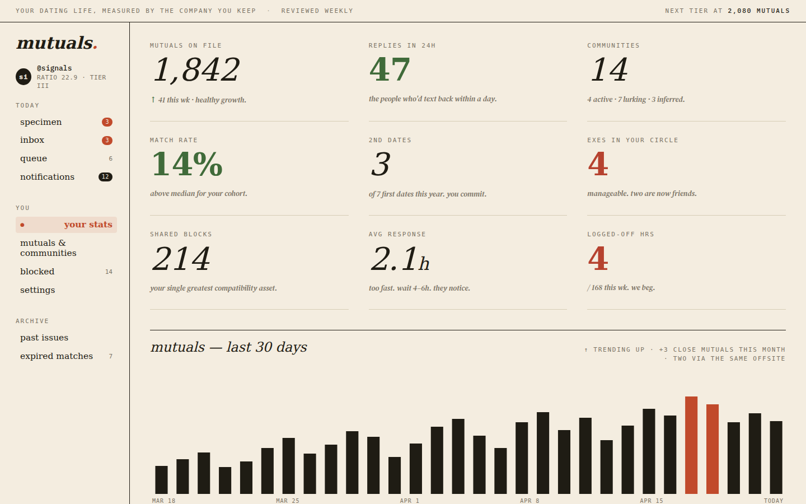
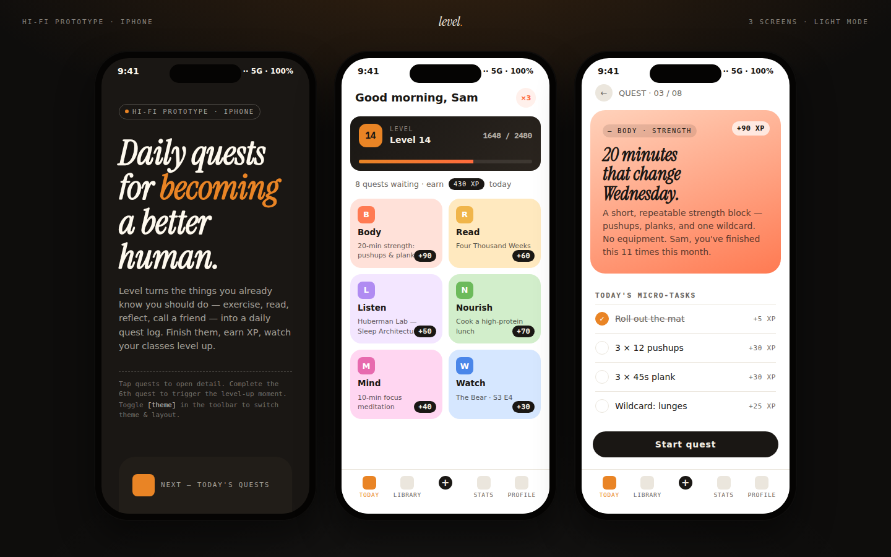
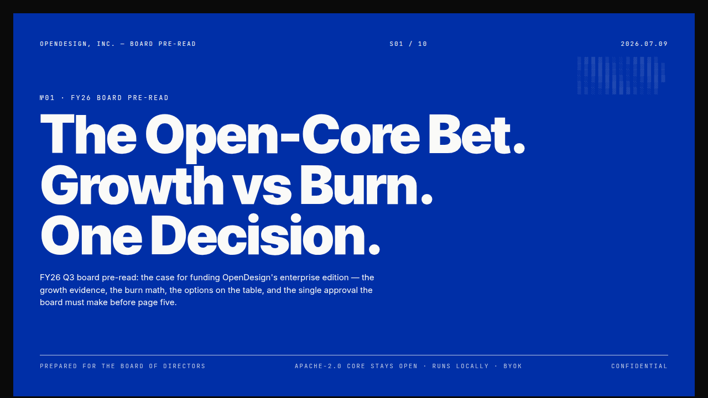
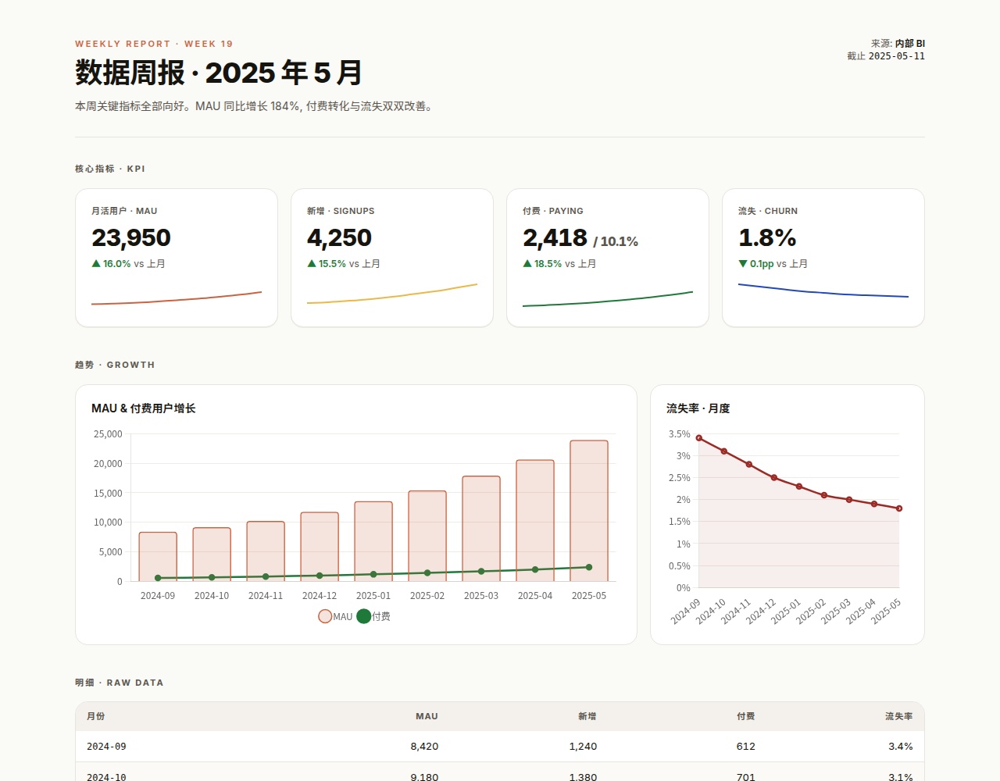
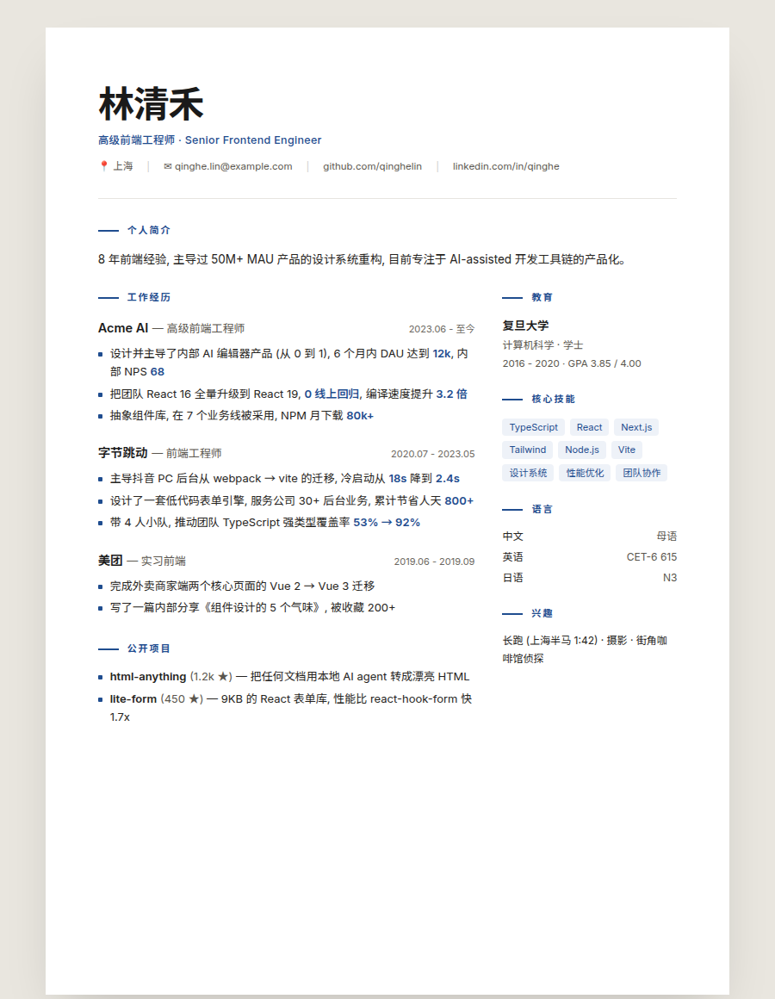

# Open Design Agent Kit

**Pro-grade design, built right into the coding agent you already use.**

Open Design Agent Kit brings [Open Design](https://github.com/nexu-io/open-design)'s design skills, brand design systems, and remixable examples into **GitHub Copilot Chat, Claude Code, Codex, Cursor**, and any other MCP-capable agent. Ask for a pitch deck, landing page, dashboard, or mobile prototype in the chat you already have open. Your agent's own model builds it with its own file tools, guided by a library that keeps the result from looking AI-generated.

**No desktop app. No daemon. No extra account, API key, or model settings.** Install it, ask, and the files show up in your repo.

## Why built-in beats another app

Open Design itself is a full local-first desktop app with its own daemon, project database, and model setup. It's excellent, but it's one more thing to install, keep running, configure, and switch into. Most of what makes it valuable day to day isn't the app. It's the **content**: 163 skills, 114 design templates, 152 brand design systems, 167 remixable example artifacts, and 11 craft docs (typography, color, accessibility, anti-"AI slop"). Agent Kit takes that content and the generation workflow around it and builds them directly into your agent:

| | Open Design desktop app | Open Design Agent Kit |
|---|---|---|
| **Install** | Desktop app plus a background daemon | One VS Code extension, Claude Code plugin, or `npx` command |
| **Where you work** | A separate app window | The agent chat you already have open |
| **Model** | Chosen and configured in the app | Whatever model your agent already uses, with no second key or bill |
| **Setup** | Providers, keys, and projects set up in the app | Nothing to configure. Your active design system is remembered per workspace. |
| **Output** | Stored in the app's project database | Plain files in your repo: diff, review, and commit them like any other code |
| **Getting to production** | Export and hand off | Promote the prototype into your real app's components, in the same session |

## What makes it different

- **Native to each agent.** It isn't a wrapper or a separate UI; each integration uses the agent's own mechanism. In Copilot, that's VS Code `languageModelTools`, chat instructions, and slash commands. In Claude Code, it's a plugin with skills and a bundled MCP server. In Codex, it's `.agents/skills` plus MCP. The agent finds the tools on its own, so you just describe what you want.
- **A curated library, not a prompt.** Task-specific recipes, brand-accurate design tokens, and hard-won craft rules. That's the difference between "a generic gradient card layout" and something that looks designed.
- **Remix, don't start blank.** Start from any of 167 real rendered examples, plus a growing community catalog, and let the model adapt one instead of inventing from scratch.
- **Brand-consistent by default.** Pick a design system once (bundled, invented from a brief, or imported from your own) and every generation after that uses it.
- **Grounded in your codebase, and headed there.** Generation looks at your real components first. When the prototype is right, one tool call ports it into your app as idiomatic production code.
- **Everything is a file.** Artifacts, manifests, comments, and custom design systems are plain files in your workspace. There's no database, no lock-in, and nothing to export.

Ways in:

- **[VS Code extension](packages/vscode/README.md)**: native tools for GitHub Copilot Chat, plus a gallery, a live artifact preview with comments and WYSIWYG editing, multi-screen collections, and Figma import and export.
- **[Claude Code plugin](docs/getting-started/claude-code.md)**: `/plugin install open-design` gives you skills that trigger on design requests (including social posts), 27 curated `/open-design:*` commands, and the MCP server, registered automatically.
- **[Codex CLI](docs/getting-started/codex.md)**: the same skills in Codex's own `.agents/skills` format, plus the MCP server.
- **[One-command project setup](packages/cli/README.md)**: `npx @feimacode/open-design-agent-kit init` wires Claude Code and/or Codex into your project.
- **[MCP server](packages/mcp-server/README.md)**: `npx @feimacode/open-design-agent-kit-mcp` for Cursor or any other MCP-capable agent.
- **Any agent via [`npx skills add`](https://github.com/vercel-labs/skills)**: `npx skills add https://github.com/feimacode/open-design-agent-kit/tree/main/packages/claude-plugin/skills/open-design` drops the same skill into any of the 75+ agents `skills` supports (Cursor, OpenCode, Cline, and more). It registers the MCP server itself the first time you ask it to design something — nothing else to run first.

Published under the **feimacode** entity; the VS Code extension's publisher id is `feima`.

## See what it builds

Six of the ~280 vendored skills and templates, rendered exactly as-is — no retouching, no cherry-picked crops:

<table>
<tr>
<td width="50%" valign="top">
 
<b>"Design a dating-site dashboard — mutuals, match rate, a 30-day trend."</b> Editorial dashboard, left-rail nav, one restrained accent color.
</td>
<td width="50%" valign="top">
 
<b>"A habit-tracking app with daily quests and XP."</b> Three-screen mobile prototype, vivid quest tiles, level bar.
</td>
</tr>
<tr>
<td width="50%" valign="top">
 
<b>"A board-ready strategy deck, Swiss International style."</b> Decision-grade corporate deck — this is slide one of ten.
</td>
<td width="50%" valign="top">
 
<b>"Turn this CSV into a weekly metrics report."</b> KPI cards, trend charts, and a raw-data table.
</td>
</tr>
<tr>
<td width="50%" valign="top">
 
<b>"5 tips, as a Xiaohongshu-style swipeable card carousel."</b> Social-native knowledge cards, ready to export as images.
</td>
<td width="50%" valign="top">
 
<b>"A modern, print-ready resume."</b> Single A4 page, ready for PDF export.
</td>
</tr>
</table>

Every one of these started from `remix_open_design_example` (copy a real example, then modify it) or `prepare_open_design_brief` (compose instructions and generate from scratch) — the same two tools regardless of which surface below you use.

## Get started

- **VS Code (GitHub Copilot Chat):** install "Open Design Agent Kit" from the [Marketplace](https://marketplace.visualstudio.com/items?itemName=feima.open-design-agent-kit). See the [getting-started guide](docs/getting-started/vscode.md).
- **Claude Code:** `/plugin marketplace add feimacode/open-design-agent-kit`, then `/plugin install open-design`. Or run `npx @feimacode/open-design-agent-kit init --tools claude` in your project. See the [getting-started guide](docs/getting-started/claude-code.md).
- **Codex CLI:** `npx @feimacode/open-design-agent-kit init --tools codex`. See the [getting-started guide](docs/getting-started/codex.md).
- **Any MCP agent (Cursor and others):** register `npx -y @feimacode/open-design-agent-kit-mcp` as a stdio MCP server. See the [MCP server README](packages/mcp-server/README.md).
- **Any of the [75+ agents `skills` supports](https://github.com/vercel-labs/skills):** `npx skills add https://github.com/feimacode/open-design-agent-kit/tree/main/packages/claude-plugin/skills/open-design` (add `--agent <name>` to target one directly). The skill wires up the MCP server on its own the first time it runs.
- **Scripts and CI:** `npx @feimacode/open-design-agent-kit export …` and `render-video …`. See the [CLI guide](docs/getting-started/cli.md).

## Documentation

Everything lives in [`docs/`](docs/README.md):

- **Guides:**
  - [generate a design](docs/guides/generate-a-design.md), [design systems](docs/guides/design-systems.md), [remix and the gallery](docs/guides/remix-and-gallery.md), [community designs](docs/guides/community-designs.md);
  - [preview, comment and edit](docs/guides/preview-comments-edit.md), [Figma](docs/guides/figma.md), [promote to app code](docs/guides/promote-to-app-code.md);
  - [social media posts](docs/guides/social-posts.md), [YouTube videos](docs/guides/youtube-video.md), [export images](docs/guides/export-images.md), [export decks and PDFs](docs/guides/export-decks.md).
- **Reference:** [tools](docs/reference/tools.md), [prompts and commands](docs/reference/prompts-and-commands.md), [CLI](docs/reference/cli.md), [settings and environment variables](docs/reference/settings-and-env.md), [artifact manifest](docs/reference/artifact-manifest.md).
- **Help:** [troubleshooting](docs/troubleshooting.md).
- **Automation:** [social media pipeline](docs/automation/social-pipeline.md).
- **Contributing:** [architecture](docs/contributing/architecture.md), [content sync](docs/contributing/content-sync.md), [adding a skill or prompt](docs/contributing/adding-a-skill-or-prompt.md), [upstream ports](docs/contributing/upstream-ports.md), [releasing](docs/contributing/releasing.md).

## Provenance

Some code is adapted from open-design (Apache-2.0): the artifact manifest logic, parts of the preview editor, and deck export. See [Upstream ports](docs/contributing/upstream-ports.md), and [`packages/core/src/vendored/SOURCE.md`](packages/core/src/vendored/SOURCE.md) for the exact record.

## License

MIT — see [LICENSE](LICENSE). Skill/design-system/craft/example content is vendored from [open-design](https://github.com/nexu-io/open-design), licensed Apache-2.0; see [Provenance](#provenance) above for which files that applies to.
