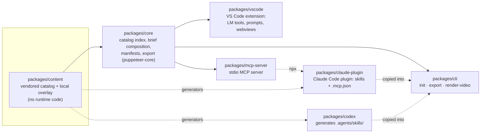
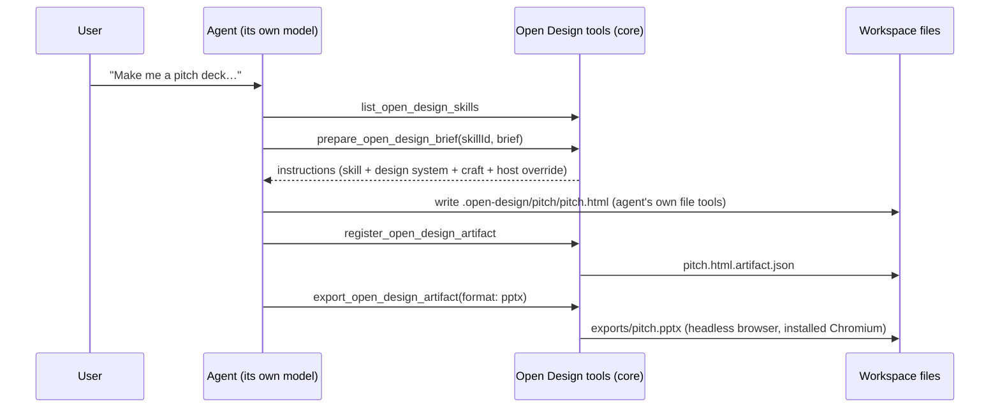

# Architecture

Open Design Agent Kit is an npm-workspaces monorepo. One framework-agnostic core does the work, a content package holds the vendored catalog, and thin host packages adapt both to each agent.

## Packages



| Package | Published as | Role |
|---|---|---|
| `core` | not published (bundled) | Everything host-agnostic: `ContentIndex` (catalog), `composeInstructions` and host overrides, manifest read/write (ported from upstream), collections, comments, Figma capture, brand extraction, and `export/` (browser discovery, image/PDF/PPTX export, deck capture). Its `main` is TypeScript source; every consumer bundles it with esbuild. |
| `content` | `@feimacode/open-design-agent-kit-content` | The vendored upstream catalog in `assets/open-design/` plus this project's own overlay. Data only; the scripts sync, overlay and check it. |
| `vscode` | VS Code extension `feima.open-design-agent-kit` | Language-model tools, chat instructions, prompt files, commands, the gallery, collections and the preview editor (webviews). Keeps its own mirror of the content, because a `.vsix` can't reach a sibling package. |
| `mcp-server` | `@feimacode/open-design-agent-kit-mcp` | The same tools over MCP (stdio), plus MCP prompts. Reads content from the content package at runtime. |
| `cli` | `@feimacode/open-design-agent-kit` | `init` (writes skills and MCP config into a project), plus `export` and `render-video`. Bundled like the MCP server. |
| `claude-plugin` | installed from this repo's marketplace | The overview skill (hand-written), generated curated and local-prompt skills, and an `.mcp.json` that runs the MCP server with `npx`. |
| `codex` | not published | Generates the repo's root `.agents/skills/` in Codex's format. |

## VS Code webviews

The Artifact Preview editor, the Gallery grid and the example preview panel are webviews (`packages/vscode/src/webview/`). They follow Open Design's own visual language, transcribed from its stylesheets:

- near-black and near-white "ink" buttons, with a pill-shaped primary action;
- a lime brand accent (`#87ea5c`) reserved for active and selected states;
- a terracotta (`#d96a46`) teardrop for comment pins;
- frosted-glass floating panels and a named radius ladder from 2 to 16 px;
- Albert Sans (SIL OFL, vendored) at weight 600.

They switch between Open Design's light and dark token sets based on VS Code's theme kind, rather than taking colors from the active theme. Gallery thumbnails are rendered from the bundled assets into `iframe.srcdoc`, lazily as cards scroll into view.

## How a generation flows



## Design principles

- **The agent writes the design.** Tools return instructions and do bookkeeping; they never generate HTML. There's no model, API key or daemon in this project.
- **Everything is a file.** Artifacts, manifests, comments, custom design systems and exports are plain files in the workspace.
- **Native per host.** VS Code gets language-model tools, prompt files and a walkthrough; Claude Code gets a plugin and skills; Codex gets `.agents/skills`; everything else gets MCP.
- **Nothing drifts silently.** Generated or mirrored content, and the docs' reference pages, are checked by `npm run lint`. See [Content sync](content-sync.md).
- **Upstream stays upstream.** Vendored content is never hand-edited; our additions live in an overlay, and ported code is attributed. See [Upstream ports](upstream-ports.md).

## Development

```bash
npm install
npm run typecheck      # every workspace
npm run lint           # eslint + every drift check + the docs check
npm run test:unit      # every workspace's tests + the docs check's tests
npm run compile        # builds the VS Code extension
```

- **VS Code:** press F5 ("Run Extension") to start an Extension Development Host.
- **MCP server:** `npm run compile --workspace=@feimacode/open-design-agent-kit-mcp`, then `node packages/mcp-server/out/index.js` (stdio).
- **Claude plugin:** `claude --plugin-dir ./packages/claude-plugin`; validate with `claude plugin validate ./packages/claude-plugin` and `claude plugin validate .`.
- Core's export tests launch a real browser when one is installed and skip otherwise. Its deck smoke test exports ten bundled decks, which takes about a minute.
