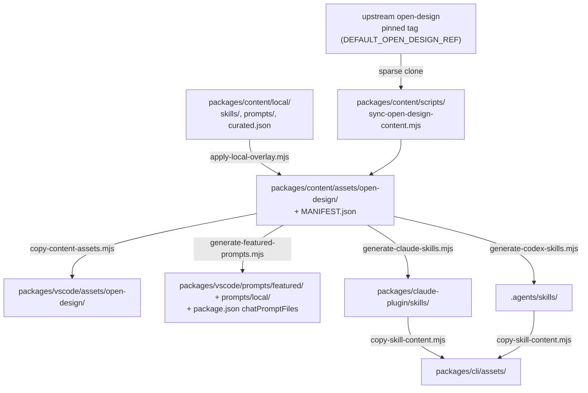

# Content sync

The skills, design templates, design systems, craft rules and examples come from upstream [Open Design](https://github.com/nexu-io/open-design) and are **vendored into this repo** (committed, about 15 MB) rather than fetched at runtime. This page covers how that content gets in, how our own additions sit on top, and what keeps every copy consistent.

## The pipeline



Run the whole pipeline with:

```bash
npm run sync-content
```

## Upstream pin

`sync-open-design-content.mjs` shallow-clones the **official repo at a tagged release** (`DEFAULT_OPEN_DESIGN_REF`, e.g. `open-design-v0.22.2`), sparse-checking out only `skills`, `design-templates`, `design-systems`, `craft` and `plugins/_official/examples`. Examples over 2 MB are skipped. The result and its source commit are recorded in `assets/open-design/MANIFEST.json`.

To update: check the [upstream tags](https://github.com/nexu-io/open-design/tags), bump `DEFAULT_OPEN_DESIGN_REF`, run `npm run sync-content`, and review the diff. For testing against a fork, set `OPEN_DESIGN_SRC` (a local checkout), `OPEN_DESIGN_REPO` or `OPEN_DESIGN_REF`. See [the variables](../reference/settings-and-env.md#contributor-only-variables).

## Local overlay

Files under `packages/content/assets/open-design/` are never hand-edited. This project's own content lives in `packages/content/local/` and is layered on top by `apply-local-overlay.mjs`, which runs at the end of every sync or alone via `npm run apply-overlay --workspace=@feimacode/open-design-agent-kit-content`:

- `local/skills/<id>/SKILL.md`: extension-authored skills (e.g. `social-youtube-thumbnail`). An id that collides with an upstream skill or template fails the sync.
- `local/prompts/<name>.md`: host-agnostic prompts (e.g. `social-post.md`), rendered per host by the generators.
- `local/curated.json`: extra entries that get a curated command even though upstream doesn't flag them. An unknown id fails generation.

See [Adding a skill or prompt](adding-a-skill-or-prompt.md).

## Curation

An entry gets a one-step command when upstream frontmatter has `featured`, `recommended` or `od.default_for`, or when it's listed in `local/curated.json`. That rule lives once in `packages/content/scripts/curatedEntries.mjs` and drives the VS Code prompt files, the Claude skills and the Codex skills.

## Drift checks (`npm run lint`)

| Check | Fails when |
|---|---|
| `packages/content/scripts/check-content-sync.mjs` | The pinned ref and `MANIFEST.json` disagree, or an overlay file is missing or stale in `assets/`. |
| `packages/vscode/scripts/check-content-mirror.mjs` | The VS Code mirror differs from `packages/content`. |
| `packages/claude-plugin/scripts/check-skills-sync.mjs` | Generated Claude skills don't match the curated set and local prompts. |
| `packages/codex/scripts/check-codex-skills-sync.mjs` | Generated Codex skills don't match, or a local-prompt skill gained an explicit-only policy. |
| `packages/cli/scripts/check-cli-assets-sync.mjs` | The CLI's copied skills are stale. |
| `scripts/check-docs.mjs` | A tool, setting, env var, command or CLI flag is undocumented, or a docs link is broken. |

Every failure message names the command that fixes it, usually `npm run sync-content`. Don't hand-edit generated output: `prompts/featured/`, `prompts/local/`, `packages/claude-plugin/skills/` (except `skills/open-design/`) and `.agents/skills/`.
